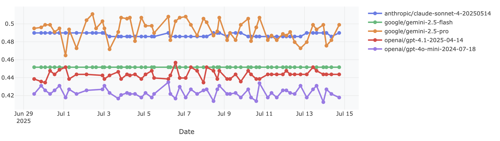
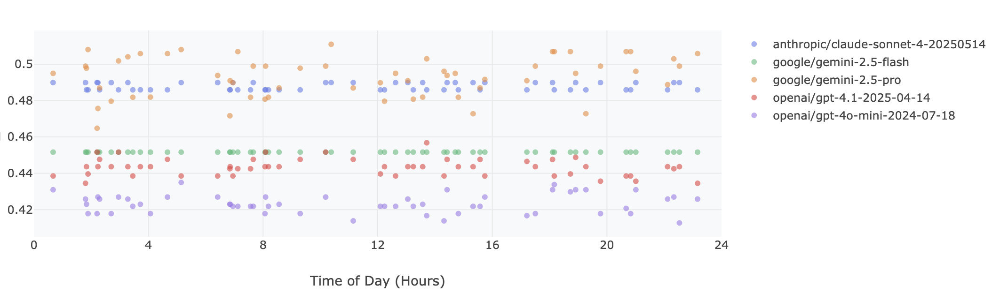
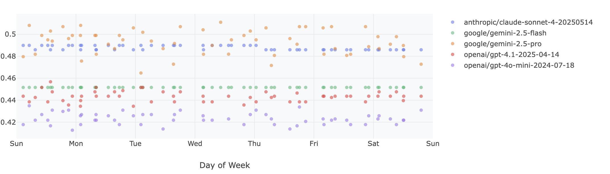
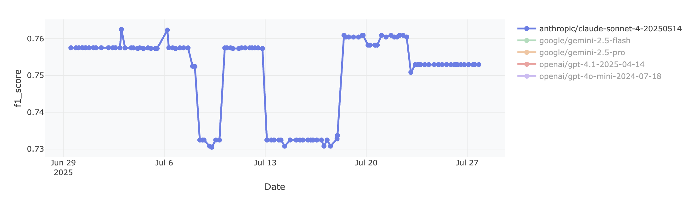
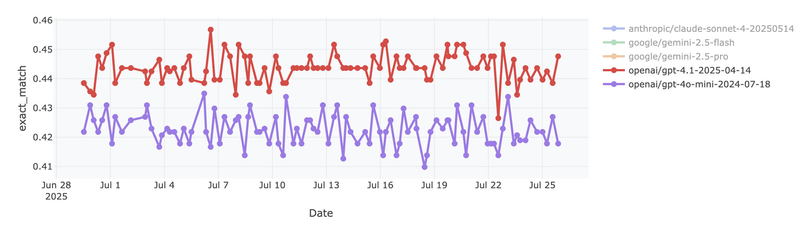

# DailyBench

**DailyBench is an automated, daily evaluation suite to track model performance over time, monitor for regression during peak load periods, and detect quality changes across flagship LLM APIs.**


*Timeline showing performance trends across multiple models and providers.*


See the live site at [https://jacobphillips99.github.io/daily-bench](https://jacobphillips99.github.io/daily-bench).

`DailyBench` is a lightweight tool evaluation suite built on a [fork](https://github.com/jacobphillips99/helm) of [HELMLite](https://crfm.stanford.edu/helm/lite/latest/) that runs standardized benchmarks against LLM APIs and tracks performance over time. This helps detect when providers make undisclosed changes to their models. `DailyBench` runs at a random time within every 6-hour window, 4 times a day. The results are aggregated and published to the public [dashboard](https://jacobphillips99.github.io/daily-bench).

We attempt to make model responses as deterministic as possible by forking HELMLite and setting all recommended parameters for each provider (seed, temperature, top_p, etc.). However, we cannot guarantee that the model responses will be exactly the same across runs and accept that there will be some variance; instead, we aim to detect if regressions or changes in model quality are happening, especially if they are happening in clear, repeated patterns.

## Why This Matters

Recent pseudo-evidence suggests that some LLM providers [quantize their models during peak US hours](https://x.com/secemp9/status/1931244386743894194) and make other undisclosed changes. Users deserve to know they're getting consistent quality from the APIs they pay for.


*Top Left: [@secemp9](https://x.com/secemp9/status/1931244386743894194), Middle Left: [@_xjdr](https://x.com/_xjdr/status/1931068996092334274), Bottom Left: [@PrimeIntellect](https://x.com/PrimeIntellect/status/1884343700245074092), Right: [@0xblacklight](https://x.com/0xblacklight/status/1931098104411103576)*

## Results

View the current benchmark data at: **[jacobphillips99.github.io/daily-bench](https://jacobphillips99.github.io/daily-bench)**

We can view model performance over time in a daily or weekly pattern. The daily performance is aggregated to show model performance at each point in time during the day; the weekly performance is aggregated to show model performance at each point in time during the week.


*daily-bench daily view*


*daily-bench weekly view*

Overall, we see some variance in model performance -- including maybe detecting some model changes. We do not detect any consistent degradations in model performance on this benchmark at the expected times of high traffic. That's a good sign!

However, it does *not* mean that models are *not* being degraded or quantized; it *does* mean that for some simple tasks, performance is maintained throughout the day and the week. This slice of HELMLite is relatively small and easier than other tasks; users working on problems at the frontier of AI may see different patterns in model quality over time.

### Interesting Patterns

Gemini 2.5 Flash performance on `exact_match` is by far the most stable and consistent model evaluated.


This view of Anthropic's Claude 4 Sonnet performance on `f1_score` depicts roughly two or three levels of stable and consistent performance. While these score changes are not correlated with time of day or day of week, they do clearly depict a switch in model quality due to the consistency of the scoring during each flip.


OpenAI models displayed the greatest variance in performance throughout the day despite `4o-mini` being the longest-running API in the evaluation suite.


## How does DailyBench work?
- 4x daily cron job runs a slice of HELMLite benchmarks against LLM APIs
- Extracts and aggregates performance metrics over time
- Provides a web dashboard to visualize trends
- Tracks performance changes that might indicate model modifications

## Setup
<details>
<summary>Click to expand</summary>

```bash
# install uv
curl -LsSf https://astral.sh/uv/install.sh | sh

# clone repo
git clone https://github.com/jacobphillips99/daily-bench.git
cd daily-bench

# install dependencies
uv sync

# activate uv env
source .venv/bin/activate
# or prepend commands with `uv run`

# Install the package in editable mode (so the CLI is on PATH)
uv pip install -e .
# or
pip install -e .
```
</details>

## Google Cloud Setup for Gemini Models

<details>
<summary>Click to expand</summary>

To use Gemini models via Vertex AI, you need to set up Google Cloud authentication:

### 1. Create a Service Account

```bash
# Set your Google Cloud project ID
export PROJECT_ID="your-project-id"

# Create a service account
gcloud iam service-accounts create daily-bench-sa \
    --description="Service account for daily-bench GitHub Actions" \
    --display-name="Daily Bench Service Account"
```

### 2. Grant Required Permissions

```bash
# Grant Vertex AI permissions
gcloud projects add-iam-policy-binding $PROJECT_ID \
    --member="serviceAccount:daily-bench-sa@$PROJECT_ID.iam.gserviceaccount.com" \
    --role="roles/aiplatform.user"

# Optional: Grant additional permissions if needed
gcloud projects add-iam-policy-binding $PROJECT_ID \
    --member="serviceAccount:daily-bench-sa@$PROJECT_ID.iam.gserviceaccount.com" \
    --role="roles/ml.developer"
```

### 3. Create and Download Service Account Key

```bash
# Create and download the service account key
gcloud iam service-accounts keys create ~/daily-bench-key.json \
    --iam-account=daily-bench-sa@$PROJECT_ID.iam.gserviceaccount.com
```

### 4. Set Up GitHub Secrets

In your GitHub repository settings, add these secrets:

- `GCP_SA_KEY`: The complete contents of the `~/daily-bench-key.json` file
- `GOOGLE_CLOUD_PROJECT`: Your Google Cloud project ID


**Note:** You may also need to enable the Cloud Resource Manager API via the [Google Cloud Console](https://console.cloud.google.com/apis/library/cloudresourcemanager.googleapis.com) if you encounter authentication errors.

**Important Notes:**
- Do NOT use your `~/.config/gcloud/application_default_credentials.json` file - this contains user OAuth credentials, not service account credentials
- The service account key JSON should have `"type": "service_account"` in it
- Keep your service account key secure and never commit it to version control

</details>

## Usage
```bash
# Run benchmarks (uses HELM Lite under the hood)
daily-bench run

# Extract results and update results CSV
daily-bench extract

# View dashboard locally
python dashboard/serve.py
```


## Developer Notes
- If you are running the dashboard locally, you need to run `daily-bench extract` to generate the CSV file in the `results/` directory.
- If you run the dashboard locally with `uv run dashboard/serve.py` and do not see an updated version of your dashboard or data, your web browser may be caching the old data. Try clearing your browser cache or using a private or incognito window.

## Contributing and Citation
`DailyBench` costs about $5/day to run. If you want to sponsor or contribute, reach out! This project was developed by [Jacob Phillips](https://jacobdphillips.com/). If you use `DailyBench` in your work, please cite it as:

```bibtex
@misc{phillips2025dailybench,
    title={daily-bench: Track and visualize model performance over time, monitor for regression during peak load periods, and detect quality changes across LLM APIs},
    author={Jacob Phillips},
    year={2025},
    howpublished={\url{https://github.com/jacobphillips99/daily-bench}}
}
```
