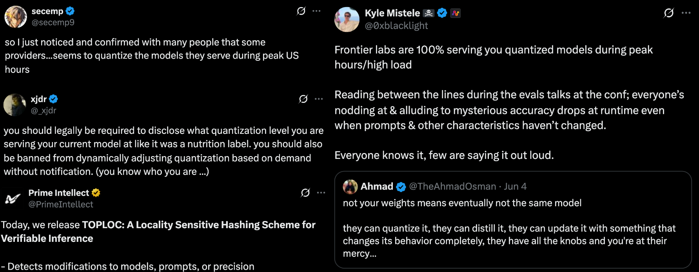

# daily-bench

**Monitoring LLM API quality through automated benchmarking.**

A lightweight tool built on HELM Lite that runs standardized benchmarks against LLM APIs and tracks performance over time. This helps detect when providers make undisclosed changes to their models.

## Why This Matters

Recent evidence suggests that some LLM providers [quantize their models during peak US hours](https://x.com/secemp9/status/1931244386743894194) and make other undisclosed changes. Users deserve to know they're getting consistent quality from the APIs they pay for.



*Top Left: [@secemp9](https://x.com/secemp9/status/1931244386743894194), Middle Left: [@_xjdr](https://x.com/_xjdr/status/1931068996092334274), Bottom Left: [@PrimeIntellect](https://x.com/PrimeIntellect/status/1884343700245074092), Right: [@0xblacklight](https://x.com/0xblacklight/status/1931098104411103576)*

## Live Results

View the current benchmark data at: **[jacobphillips99.github.io/daily-bench](https://jacobphillips99.github.io/daily-bench)**

## What This Does

- Runs a limited set of HELM Lite benchmarks against LLM APIs
- Extracts and aggregates performance metrics over time
- Provides a web dashboard to visualize trends
- Tracks performance changes that might indicate model modifications

## Usage

```bash
# Install dependencies
pip install -e .

# Run benchmarks (uses HELM Lite under the hood)
daily-bench run

# Extract results to CSV
daily-bench extract

# View dashboard locally
open dashboard/index.html
```

## Current Implementation

This tool wraps [HELM Lite](https://crfm.stanford.edu/helm/) and provides:
- Simple CLI for running benchmarks
- Results extraction to CSV format
- Basic web dashboard for visualization
- Incremental processing of new benchmark runs

Built with Python, uses CRFM HELM for benchmarking, and generates static HTML dashboards.

## Contributing